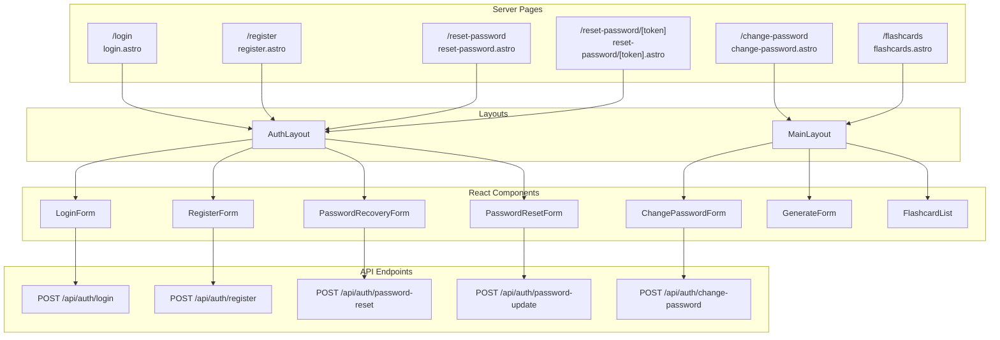

<mermaid_diagram>

```mermaid
flowchart TD
  subgraph "Layouts"
    AL[AuthLayout]
    ML[MainLayout]
  end

  subgraph "Server Pages"
    LP["/login<br/>login.astro"]
    RP["/register<br/>register.astro"]
    RRP["/reset-password<br/>reset-password.astro"]
    RRPT["/reset-password/[token]<br/>reset-password/[token].astro"]
    CP["/change-password<br/>change-password.astro"]
    FP["/flashcards<br/>flashcards.astro"]
  end

  subgraph "React Components"
    LF[LoginForm]
    RF[RegisterForm]
    PRF[PasswordRecoveryForm]
    PTF[PasswordResetForm]
    CPF[ChangePasswordForm]
    GF[GenerateForm]
    FL[FlashcardList]
  end

  subgraph "API Endpoints"
    API_Login["POST /api/auth/login"]
    API_Register["POST /api/auth/register"]
    API_PWReset["POST /api/auth/password-reset"]
    API_PWUpdate["POST /api/auth/password-update"]
    API_ChgPW["POST /api/auth/change-password"]
  end

  LP --> AL
  RP --> AL
  RRP --> AL
  RRPT --> AL
  CP --> ML
  FP --> ML

  AL --> LF
  AL --> RF
  AL --> PRF
  AL --> PTF
  ML --> CPF
  ML --> GF
  ML --> FL

  LF --> API_Login
  RF --> API_Register
  PRF --> API_PWReset
  PTF --> API_PWUpdate
  CPF --> API_ChgPW
```  

</mermaid_diagram> 